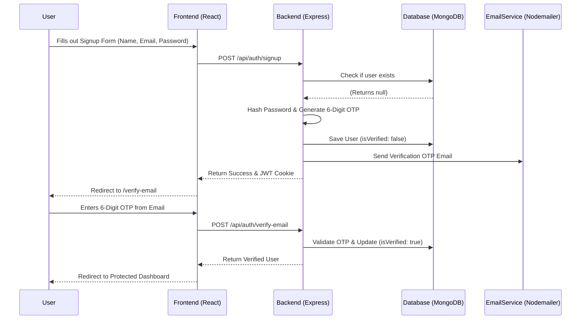
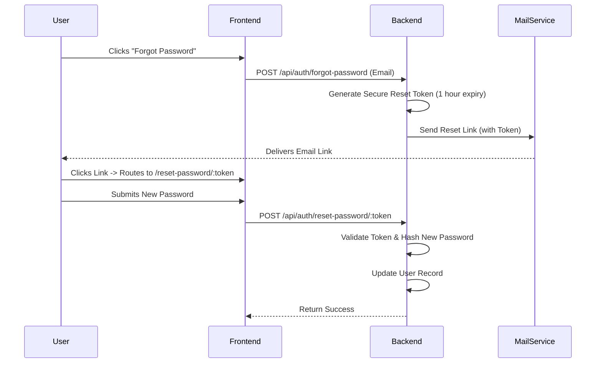

# 🛡️ Advanced MERN Authentication System

A complete full-stack Authentication and User Management system built with the MERN stack (MongoDB, Express, React, Node.js). Features include secure JWT authentication, email verification via Nodemailer, password recovery flows, and a premium "Glassmorphism" UI design built with Framer Motion.

## ✨ Features
- **Secure Authentication**: Session management stored securely in HTTP-only cookies to prevent XSS & CSRF attacks.
- **Email Verification**: NodeMailer-powered 6-digit OTP verification required upon registration.
- **Password Recovery**: Secure cryptographic token generation and email routing for forgotten passwords.
- **Protected Routes**: Extensive React Router integration to redirect unauthenticated or unverified users away from protected dashboard views.
- **Premium UI**: Modern dark-mode aesthetics using pure Vanilla CSS, dynamic floating background shapes, smooth transitions via Framer Motion, and lucid iconography.
- **Global State**: Minimalist React state management using `Zustand`.

---

## 🏗️ System Architecture & Data Flow

### 1. User Registration & Email Verification Flow

### 2. Password Recovery Flow

---

## 🚀 Installation & Setup

### Prerequisites
- Node.js installed
- MongoDB Atlas connection URI
- Gmail account with an App Password (for Nodemailer)

### 1. Clone the repository
\`\`\`bash
git clone https://github.com/SubhayuBaliyarsingh/Secure-User-Authentication-.git
cd Secure-User-Authentication-
\`\`\`

### 2. Configure Environment Variables
Inside the `backend/` directory, create a `.env` file containing:
\`\`\`env
# backend/.env
PORT=5001
MONGODB_URI=your_mongodb_cluster_uri
JWT_SECRET=any_highly_secure_random_string
CLIENT_URL=http://localhost:5173
SMTP_HOST=smtp.gmail.com
SMTP_PORT=587
SMTP_USER=your_email@gmail.com
SMTP_PASS=your_gmail_app_password
\`\`\`

### 3. Install Dependencies
Open two distinct terminal instances:

**Terminal 1 (Backend):**
\`\`\`bash
cd backend
npm install
npm run dev
\`\`\`

**Terminal 2 (Frontend):**
\`\`\`bash
cd frontend
npm install
npm run dev
\`\`\`

### 4. Access the Application
Visit \`http://localhost:5173\` in your browser to interact with the application.

---

## 🛠️ Tech Stack
- **Frontend**: React (Vite), Zustand, React Router DOM, Framer Motion, Lucide React
- **Backend**: Node.js, Express.js, JWT, BcryptJS, Nodemailer
- **Database**: MongoDB, Mongoose
